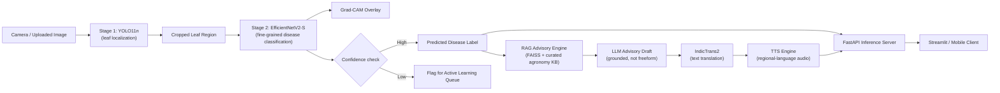

# 🌿 AgriVision — Multi-Crop Leaf Disease Detection & Multilingual Advisory System

Real-time leaf disease detection across 13 crop species, paired with a retrieval-grounded, multilingual **audio** treatment advisory pipeline — built for field usability, not just benchmark accuracy.

> Redesigned from an initial YOLOv8 prototype into a two-stage detection→classification system with explainability, retrieval-grounded advisory generation, and edge-deployable inference.

---

## Why this redesign

The original prototype ran a single YOLOv8 model doing both leaf localization *and* fine-grained disease classification in one shot, called an LLM directly with a raw prompt for treatment advice, and used `googletrans` (an unofficial, frequently-breaking wrapper around Google Translate) for regional-language output. That's fine for a demo; it doesn't hold up to scrutiny in a systems interview. The changes below target three things graders/recruiters actually probe: **architectural reasoning** (why two stages, why these models), **evaluation rigor** (are the numbers trustworthy), and **deployability** (does it run outside your laptop).

---

## Architecture



**Why two stages instead of one YOLO model doing everything:** several PlantDoc classes are visually near-identical at the bounding-box level (e.g. *Tomato Early Blight* vs *Tomato Septoria Leaf Spot*) and a single detector conflates localization loss with fine-grained classification loss. Splitting localization (YOLO11n) from classification (EfficientNetV2-S, trained on tightly-cropped leaf patches) lets each stage optimize for what it's actually good at, and lets you swap the classifier independently as new disease classes are added — without retraining detection.

**Why these specific models, not heavier ones:** YOLO11n (~2.6M params) and EfficientNetV2-S (~21M params, but fast due to progressive-resizing training) are both real-time-capable on a single consumer GPU and exportable to ONNX/TensorRT for edge devices (Jetson Nano, Raspberry Pi + Coral). A ViT-Large or YOLOv8x backbone would gain marginal accuracy at a cost this use case (field deployment, farmer-facing hardware) can't absorb.

---

## Key Features

| Feature | Detail |
|---|---|
| **Two-stage detection + classification** | YOLO11n for localization, EfficientNetV2-S for disease ID — decouples the two problems |
| **Explainability** | Grad-CAM heatmaps over the classifier so predictions are auditable, not a black box |
| **Retrieval-grounded advisory** | Treatment text is generated via RAG over a curated agronomy knowledge base (FAISS), not a raw LLM prompt — reduces hallucinated dosages/treatments |
| **Multilingual audio output** | IndicTrans2 for text translation (Hindi, Telugu, Marathi, Tamil) + TTS for spoken advisories — usable by farmers with low literacy |
| **Active learning loop** | Low-confidence predictions are logged to a review queue instead of silently failing, feeding future fine-tuning rounds |
| **Edge-deployable** | ONNX export + INT8 quantization path for on-device inference without a network round-trip |
| **Reproducible experiments** | Stratified k-fold splits, W&B experiment tracking, DVC-versioned datasets/weights |

---

## Tech Stack

| Layer | Tools |
|---|---|
| Detection | YOLO11n (Ultralytics), trained on PlantDoc |
| Classification | EfficientNetV2-S, transfer-learned, fine-tuned on cropped leaf patches |
| Explainability | Grad-CAM (`pytorch-grad-cam`) |
| Advisory generation | LangChain + FAISS (retrieval) + LLM (configurable: GPT-4o-mini or local Llama-3-8B-Instruct) |
| Translation | IndicTrans2 (AI4Bharat) |
| Speech synthesis | Coqui TTS / gTTS fallback |
| Serving | FastAPI (REST), Streamlit (demo client) |
| Experiment tracking | Weights & Biases |
| Data/model versioning | DVC |
| Packaging | Docker, ONNX Runtime |
| CI | GitHub Actions (lint + pytest + training smoke test) |

---

## Dataset

- **Primary:** [PlantDoc](https://github.com/pratikkayal/PlantDoc-Dataset) — 2,598 real-world field images, 13 plant species, 29 disease/healthy classes. Chosen over lab-condition datasets (e.g. plain PlantVillage) because field-realistic backgrounds and lighting are what a deployed system actually sees.
- **Supplementary:** PlantVillage classes merged in for species/diseases underrepresented in PlantDoc, reconciled under a unified label taxonomy (`data/taxonomy_map.yaml`).
- **Splits:** stratified 70/15/15 train/val/test at the class level, with k-fold cross-validation (k=5) for the classifier to get a variance estimate on small classes, not just a single-split accuracy number.

---

## Project Structure

```
agrivision/
├── configs/                  # YAML configs for detection + classification training
├── data/
│   ├── raw/                  # PlantDoc + PlantVillage (not committed — see data/README.md)
│   └── taxonomy_map.yaml     # unified class mapping across datasets
├── src/
│   ├── detection/            # YOLO11n training / inference
│   ├── classification/       # EfficientNetV2-S training / inference
│   ├── explainability/       # Grad-CAM utilities
│   ├── advisory/             # RAG pipeline: retriever, prompt templates, LLM client
│   ├── translation/          # IndicTrans2 + TTS wrappers
│   └── serving/              # FastAPI app
├── notebooks/                 # EDA, error analysis, class-confusion inspection
├── tests/                     # pytest unit + integration tests
├── docker/
├── .github/workflows/ci.yml
├── requirements.txt
└── README.md
```

---

## Installation

```bash
git clone https://github.com/positron1253/plant-leaf-virus-detection.git
cd plant-leaf-virus-detection
python -m venv .venv && source .venv/bin/activate
pip install -r requirements.txt
```

Set required secrets as environment variables — **never commit these**:

```bash
export OPENAI_API_KEY="..."      # or point advisory/config.yaml at a local Llama-3 endpoint
export WANDB_API_KEY="..."
```

## Usage

```bash
# Train detector
python -m src.detection.train --config configs/yolo11n.yaml

# Train classifier on cropped leaf patches
python -m src.classification.train --config configs/effnetv2s.yaml

# Run inference on an image
python -m src.serving.predict --image samples/leaf.jpg --lang hi --audio

# Launch API + demo client
uvicorn src.serving.app:app --reload
streamlit run src/serving/demo_app.py
```

---

## Results

> To be filled in after the current training run completes — report per-class Precision/Recall/F1, mAP@0.5 for detection, and overall + per-class accuracy for classification, with a confusion matrix. Don't publish a single headline accuracy number without the class-level breakdown; PlantDoc classes are imbalanced and a high overall accuracy can hide near-zero recall on rare classes.

| Metric | Detection (YOLO11n) | Classification (EfficientNetV2-S) |
|---|---|---|
| mAP@0.5 | TBD | — |
| Top-1 Accuracy | — | TBD |
| Macro F1 | TBD | TBD |
| Inference latency (RTX-class GPU) | TBD | TBD |
| Inference latency (edge, INT8) | TBD | TBD |

---

## Roadmap / Implementation Status

| Component | Status |
|---|---|
| YOLO-based leaf detection | ✅ Implemented (single-stage prototype) |
| Two-stage detection→classification split | 🔲 Planned |
| Grad-CAM explainability | 🔲 Planned |
| RAG-grounded advisory (replacing raw LLM prompt) | 🔲 Planned |
| IndicTrans2 translation (replacing `googletrans`) | 🔲 Planned |
| Audio advisory (TTS) | 🔲 Planned |
| FastAPI serving layer | 🔲 Planned |
| ONNX export + quantization | 🔲 Planned |
| CI (GitHub Actions) | 🔲 Planned |
| Active learning queue | 🔲 Planned |

---

## Limitations

- PlantDoc's 29 classes are not exhaustive of field diseases; out-of-distribution crops/diseases will be misclassified with false confidence unless the confidence-threshold-to-active-learning-queue path is respected.
- RAG advisory quality is bounded by the curated knowledge base — it does not replace a certified agronomist for high-stakes treatment decisions (e.g. pesticide dosing).
- TTS quality for lower-resource Indian languages varies; Hindi/Telugu are well-supported, some regional dialects are not.

---

## License

MIT — see `LICENSE`.

## Acknowledgements

- [PlantDoc Dataset](https://github.com/pratikkayal/PlantDoc-Dataset)
- [Ultralytics YOLO](https://github.com/ultralytics/ultralytics)
- [AI4Bharat IndicTrans2](https://github.com/AI4Bharat/IndicTrans2)
